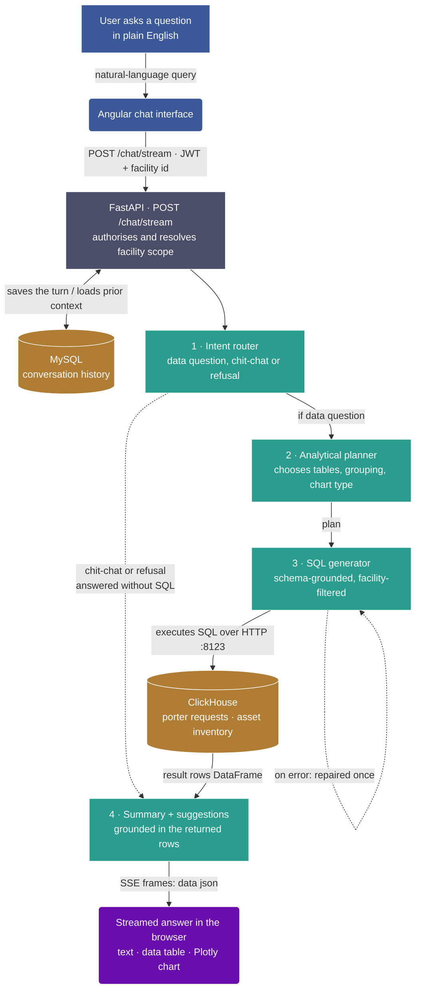

# 📊 TrackerWave Analytics Platform

## 📑 Summary
The TrackerWave Analytics Platform is a unified, AI-powered conversational chatbot built to seamlessly query, analyze, and visualize data for **Porter Request Management** and **Asset Management**. By leveraging advanced Natural Language Processing (Azure OpenAI) and a blazing-fast columnar database (ClickHouse), users can ask plain English questions about hospital operations, and instantly receive accurate data tables, dynamic charts, and intelligent narrative summaries.

---

## ✨ Features
- **Conversational Interface**: Ask questions naturally in a chat-like interface. Supports follow-up questions and conversational memory.
- **Dynamic Facility Scope**: Facility context (ID and Region) is securely resolved dynamically from the Angular UI HTTP payload headers, ensuring strict data isolation without hardcoded configurations.
- **Smart Routing & Domain Detection**: Automatically routes questions to the appropriate domain (Porter operations vs. Asset tracking) or answers general conversational greetings instantly.
- **Automated SQL Generation**: Translates natural language into optimized ClickHouse SQL queries targeted exclusively at the `ovitag_dw.dim_customer` and related fact tables.
- **Dynamic Visualizations**: Automatically recommends the best chart type (Bar, Line, Pie, Scatter) and renders interactive Plotly charts in Angular.
- **Cross-Conversation Context**: "Found in" folder links easily navigate users back to related queries previously asked.
- **Actionable AI Insights**: Beyond raw data, the chatbot provides a human-readable summary of the metrics with actionable insights.
- **Export Functionality**: Easily export data to CSV, Excel, or PDF.

---

## 🏗️ Architecture & Request Flow

The platform follows a modern, separated backend/frontend architecture with real-time streaming capabilities.

### End-to-end Request Flow



### Core Components
1. **Frontend (Angular)**: 
   - A reactive, component-based UI built with Angular and TailwindCSS.
   - Manages state using RxJS and handles Server-Sent Events (SSE) for real-time typewriter-style chat responses.
   - Dynamically renders interactive charts using Plotly.js.

2. **Backend (Python / FastAPI)**:
   - Serves as the core orchestrator, exposing REST and SSE endpoints.
   - Utilizes a robust AI pipeline (`Intent Router` -> `Analytical Planner` -> `SQL Generator` -> `Summary & Suggestions`).
   - Extracts Facility scopes directly from request headers.

3. **Databases**:
   - **ClickHouse**: High-performance analytical database containing massive volumes of IoT telemetry, Porter Requests, and Asset Tracking data.
   - **MySQL**: Persistent storage for conversation history and user session management.

---

## 🧪 Testing & AI Validation

To ensure enterprise-grade reliability, the TrackerWave platform is strictly validated through automated and manual testing suites.

### 1. Automated Unit Testing
The project includes a robust suite of `pytest` unit and integration tests located in the `/tests` directory:
- **`test_pool.py`**: Validates database connection pool acquisition and release under simulated concurrency.
- **`test_recs.py`**: Tests the recommendation formatting pipeline and prompt builders.
- **`test_chatbot.py` & `test_sql_pipeline.py`**: Verify intent routing, schema grounding, and SQL generation logic.

### 2. Manual AI Evaluation Dashboard
The repository features a custom-built, interactive testing dashboard tailored for evaluating the LLM's accuracy. 
- Located in: `/testing_report/test_report_app.py`
- Built with **Streamlit** (Light Theme).
- Used to manually review benchmark test cases and track key metrics such as:
  - **F1-Score (Query Intent)**
  - **SQL Execution Accuracy**
  - **Hallucination Rate**

---

## 🚀 Getting Started

Follow these steps to clone the repository and get the application running locally on bare-metal (No Docker required).

### 1. Clone the Repository
```bash
git clone https://github.com/Sujitha1306/Chatbot_TW.git
cd Chatbot_TW
```

### 2. Setup and Run the Backend (FastAPI)
The backend is built with Python. We recommend using a virtual environment.

```bash
# 1. Create a Python virtual environment
python3 -m venv .venv

# 2. Activate the virtual environment
# On macOS/Linux:
source .venv/bin/activate
# On Windows:
# .venv\Scripts\activate

# 3. Install all dependencies (consolidated requirements)
pip install -r requirements.txt

# 4. Set up environment variables
cp .env.example .env
# Edit .env with your Azure OpenAI keys, ClickHouse, and MySQL credentials

# 5. Start the backend server
./.venv/bin/uvicorn backend.app.main:app --port 8000 --reload
```
*(Note: If you have `APP_PORT` configured in your `.env`, replace 8000 with that port value)*

### 3. Setup and Run the Frontend (Angular)
The frontend requires Node.js and npm.

```bash
# 1. Open a new terminal window/tab
# 2. Navigate to the frontend directory
cd frontend/chat-bot

# 3. Install NPM dependencies
npm install

# 4. Start the Angular development server
npm start
```
The frontend UI will now be running at `http://localhost:4200`.

---

## 💡 Example Questions & Expected Results

### Question 1: Porter Workload
**You ask:** *"What is the porter completion rate for the selected facility?"*
**Expected Result:** The AI generates a Bar chart showing completed vs. total requests for the facility.

### Question 2: Asset Tracking
**You ask:** *"Show me the asset status breakdown."*
**Expected Result:** A Pie Chart showing counts of `ATS-INU`, `ATS-ONB`, `Active`, etc., with an explanatory summary.

### Question 3: Time Series Analysis
**You ask:** *"Show porter requests trend over time."*
**Expected Result:** A Line Chart displaying the volume of requests grouped by Month and Year alongside a data table.

### Question 4: Conversational Greeting
**You ask:** *"Hi, what can you do?"*
**Expected Result:** The Intent Router intercepts the query as chit-chat, bypasses the database entirely, and streams back a friendly greeting explaining its capabilities.